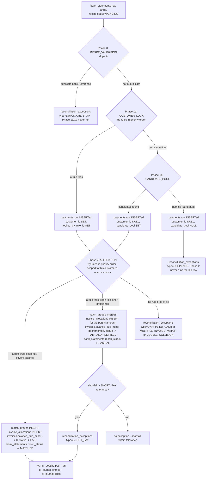

# One Invoice's Journey Through the Reconciliation Engine

A worked example, using two real cases from the golden test dataset (`tests/reconciliation/test_golden_m2.py`): one that ends up **fully matched**, one that ends up **partially matched + flagged as an exception**. Every rule name, table name, column name, and SQL statement below is real, copied verbatim from `app/reconciliation/dao.py` — with the bind parameters inlined as literal values so you can read them directly, since `dao.py` itself only ever uses parameterized placeholders (`$1`, `$2`, ...), never string-concatenated SQL. UUIDs are illustrative (internally consistent, formatted like real ones) except the three `rule_id`s, which are pulled live from the seeded definition. Amounts are in minor units (paise; ₹1 = 100).

---

## 1. The cast

| | |
|---|---|
| **Customer** | Nimbus Traders (`customer_code=CUST-003`, `vpa_handle=nimbus@okhdfc`) — `customer_id = 44444444-4444-4444-4444-444444444444` |
| **Invoice A** | `INV-2026-105`, total ₹8,000.00 (`800000`), issued 2026-07-03 — `invoice_id = 66666666-6666-6666-6666-666666666666` |
| **Bank row A** | narration `"UPI/nimbus@okhdfc/PAYMENT INV-2026-105"`, amount ₹8,000.00 (`800000`) — `bank_txn_id = 88888888-8888-8888-8888-888888888888` |
| **Customer** | Kestrel Freight Co (`customer_code=KEST04`) — `customer_id = 55555555-5555-5555-5555-555555555555` |
| **Invoice B** | `INV-2026-107`, total ₹7,000.00 (`700000`), issued 2026-06-20 — `invoice_id = 77777777-7777-7777-7777-777777777777` |
| **Bank row B** | narration `"NEFT TRANSFER REF KEST04 SHORT PAY INV-2026-107"`, amount ₹5,000.00 (`500000`) — `bank_txn_id = 99999999-9999-9999-9999-999999999999` |
| **Shared context** | `entity_id = 11111111-1111-1111-1111-111111111111`, `definition_id = 22222222-2222-2222-2222-222222222222`, `run_id = 33333333-3333-3333-3333-333333333333`, `period_end = 2026-07-31` |

Invoice A's bank row pays in full → **Matched**. Invoice B's bank row is ₹2,000 short → **Matched partially, and flagged as a Short-Pay exception**. Both invoice numbers happen to appear verbatim in their narration, so both get identified by the *same* Phase 2 rule (`exact-invoice-num`) — what differs is only the amount, and that's what decides the outcome.

---

## 2. The engine flow, phase by phase



Both worked examples below take the `C → D → G → H` path (Invoice A) and the `C → D → G → I → I2` path (Invoice B) respectively.

---

## 3. Once per run, before either bank row is touched

`engine.run_phase_1` and `run_phase_2` each load their whole working set **once** at the start of the run, into memory — not once per bank row. Both walkthroughs below share these same six queries; they're not repeated per invoice.

```sql
-- dao.list_rules(definition_id) - every rule for this definition, in evaluation order
SELECT rule_id, definition_id, phase, kind, name, priority, enabled, confidence, config
FROM reconciliation_rules
WHERE definition_id = '22222222-2222-2222-2222-222222222222'
ORDER BY phase, priority;

-- dao.list_candidate_bank_inflows(entity_id) - every unreconciled credit inflow for this run
SELECT bank_txn_id, transaction_date, bank_reference, narration, payer_name,
       payer_account_no, payer_ifsc, amount_minor, amount_home_minor, currency, explicit_fee_minor
FROM bank_statements
WHERE entity_id = '11111111-1111-1111-1111-111111111111'
  AND recon_status = 'PENDING' AND dr_cr = 'CREDIT' AND is_bank_charge = false
ORDER BY transaction_date, bank_txn_id;

-- dao.load_customer_master(entity_id)
SELECT customer_id, company_name, customer_code, pan, gstin, vpa_handle
FROM customers
WHERE entity_id = '11111111-1111-1111-1111-111111111111';

-- dao.load_customer_bank_accounts(entity_id)
SELECT a.customer_id, a.bank_account_no, a.ifsc_code
FROM customer_bank_accounts a JOIN customers c ON c.customer_id = a.customer_id
WHERE c.entity_id = '11111111-1111-1111-1111-111111111111' AND a.status = 'ACTIVE';

-- dao.load_customer_reference_codes(entity_id)
SELECT r.customer_id, r.code_value, r.code_type
FROM customer_reference_codes r JOIN customers c ON c.customer_id = r.customer_id
WHERE c.entity_id = '11111111-1111-1111-1111-111111111111' AND r.is_active = true;

-- dao.load_expected_remittances(entity_id)
SELECT e.customer_id, e.utr_number
FROM expected_remittances e JOIN customers c ON c.customer_id = e.customer_id
WHERE c.entity_id = '11111111-1111-1111-1111-111111111111' AND e.utr_number IS NOT NULL;
```

Phase 2 (once `run_phase_1` hands off its outcomes) loads two more, also once for the whole run:

```sql
-- dao.load_open_invoices(entity_id, period_end)
SELECT invoice_id, customer_id, invoice_number, issue_date, due_date,
       total_amount_minor, balance_due_minor, allowed_tds_minor, tds_rate_pct, status
FROM invoices
WHERE entity_id = '11111111-1111-1111-1111-111111111111' AND status != 'PAID'
  AND (NULL::date IS NULL OR issue_date <= '2026-07-31')
ORDER BY customer_id, due_date, invoice_id;

-- dao.load_open_memos(entity_id)
SELECT m.memo_id, m.customer_id, m.invoice_id, m.memo_type, m.memo_date, m.amount_minor
FROM credit_debit_memos m JOIN customers c ON c.customer_id = m.customer_id
WHERE c.entity_id = '11111111-1111-1111-1111-111111111111' AND m.is_open = true;
```

Everything below — `exact-invoice-num`, `upi`, `customer-code` actually deciding whether they match — happens in **Python**, against these already-loaded lists. No further SELECT touches `customers`/`invoices`/`bank_statements` per bank row; only the writes below hit the DB again.

---

## 4. Walkthrough A — Matched (`INV-2026-105`)

### Step 1 — Ingestion (already done before the engine runs at all)

A row already sits in `bank_statements` with `recon_status='PENDING'`, and `invoices` already has `INV-2026-105` open with `balance_due_minor=800000`. Nothing about matching has happened yet.

### Step 2 — Phase 0 (`INTAKE_VALIDATION`): `dup-utr`

`dup_utr_check` first checks the in-memory `duplicate_refs_in_run` set (built once, in Python, from the batch already loaded above — no query). Only if that's clear does it check the cross-run half:

```sql
-- dao.bank_reference_already_matched(entity_id, bank_reference, exclude_bank_txn_id)
SELECT 1 FROM bank_statements
WHERE entity_id = '11111111-1111-1111-1111-111111111111'
  AND bank_reference = 'UTR-NIM-005'
  AND recon_status = 'MATCHED'
  AND bank_txn_id != '88888888-8888-8888-8888-888888888888';
```

No row comes back. Passes through. **Nothing written yet.**

### Step 3 — Phase 1a (`CUSTOMER_LOCK`): identification

The engine tries every enabled `CUSTOMER_LOCK` rule in priority order, all against the in-memory customer list from Section 3 — no queries. `expected-utr` (priority 1) misses. `account-ifsc` (priority 2) misses — no account number on this bank row at all (it's a UPI payment). `upi` (priority 3, `rule_id=4be52354-6240-4246-b319-1a476d181647`) runs `extract:vpa` against the narration, pulls out `nimbus@okhdfc`, compares it to every customer's `vpa_handle` in memory — **exact match** against Nimbus Traders. First match wins.

```sql
-- dao.insert_payment(bank_txn_id, customer_id, total_received_minor, locked_by_rule_id, candidate_pool)
INSERT INTO payments (payment_id, bank_txn_id, customer_id, total_received_minor, unapplied_minor,
                       locked_by_rule_id, candidate_pool)
VALUES (gen_random_uuid(),
        '88888888-8888-8888-8888-888888888888',
        '44444444-4444-4444-4444-444444444444',
        800000, 800000,
        '4be52354-6240-4246-b319-1a476d181647',
        NULL)
RETURNING payment_id, bank_txn_id, customer_id, total_received_minor, unapplied_minor,
          locked_by_rule_id, candidate_pool;
-- => payment_id = 'aaaaaaaa-1111-1111-1111-111111111111'
```

**Write #1** — `payments`:

| payment_id | bank_txn_id | customer_id | total_received_minor | unapplied_minor | locked_by_rule_id |
|---|---|---|---|---|---|
| `aaaaaaaa-1111-1111-1111-111111111111` | `88888888-...` | `44444444-...` (Nimbus) | 800000 | 800000 | `4be52354-...` (upi) |

### Step 4 — Phase 2 (`ALLOCATION`): scoped to Nimbus's open invoices

Scope is narrowed, in Python, to just Nimbus Traders' open invoices from the Section 3 list. `exact-invoice-num` (priority 1, `rule_id=d9d5631a-ee45-4880-bb19-d9c6f3cb93dd`) checks: does the full invoice number `INV-2026-105` appear verbatim in the narration? Yes. `cash = min(payment_amount, balance) = min(800000, 800000) = 800000` — exactly covers the balance, so `match_type="EXACT"`. Four writes follow, in this order:

```sql
-- 1) dao.insert_match_group(run_id, match_type, rule_id, confidence, status, reason)
INSERT INTO match_groups (match_group_id, run_id, match_type, rule_id, confidence, status, reason)
VALUES (gen_random_uuid(),
        '33333333-3333-3333-3333-333333333333',
        'EXACT',
        'd9d5631a-ee45-4880-bb19-d9c6f3cb93dd',
        98, 'AUTO_MATCHED',
        'invoice_number ''INV-2026-105'' in narration')
RETURNING match_group_id, run_id, match_type, rule_id, confidence, status, reason;
-- => match_group_id = 'bbbbbbbb-1111-1111-1111-111111111111'

-- 2) dao.apply_invoice_allocation(invoice_id, amount_minor)
UPDATE invoices
SET balance_due_minor = balance_due_minor - 800000,
    status = CASE WHEN balance_due_minor - 800000 <= 0 THEN 'PAID' ELSE 'PARTIALLY_SETTLED' END,
    updated_at = now()
WHERE invoice_id = '66666666-6666-6666-6666-666666666666'
RETURNING invoice_id, balance_due_minor, status;
-- => balance_due_minor = 0, status = 'PAID'

-- 3) dao.insert_invoice_allocation(match_group_id, invoice_id, payment_id, bank_txn_id, allocated_minor)
INSERT INTO invoice_allocations (allocation_id, match_group_id, invoice_id, payment_id, bank_txn_id, allocated_minor)
VALUES (gen_random_uuid(),
        'bbbbbbbb-1111-1111-1111-111111111111',
        '66666666-6666-6666-6666-666666666666',
        'aaaaaaaa-1111-1111-1111-111111111111',
        '88888888-8888-8888-8888-888888888888',
        800000)
RETURNING allocation_id, match_group_id, invoice_id, payment_id, bank_txn_id, allocated_minor;
-- => allocation_id = 'cccccccc-1111-1111-1111-111111111111'

-- 4) dao.apply_payment_allocation(payment_id, amount_minor)
UPDATE payments
SET unapplied_minor = unapplied_minor - 800000
WHERE payment_id = 'aaaaaaaa-1111-1111-1111-111111111111'
RETURNING payment_id, unapplied_minor, customer_id;
-- => unapplied_minor = 0
```

No `still_open` invoices, so the engine takes the "matched" branch:

```sql
-- dao.mark_bank_statement_status(bank_txn_id, recon_status)
UPDATE bank_statements
SET recon_status = 'MATCHED'
WHERE bank_txn_id = '88888888-8888-8888-8888-888888888888';
```

**Write #2** — `match_groups`:

| match_group_id | run_id | match_type | rule_id | confidence | status | reason |
|---|---|---|---|---|---|---|
| `bbbbbbbb-1111-...` | `33333333-...` | EXACT | `d9d5631a-...` | 98 | AUTO_MATCHED | `invoice_number 'INV-2026-105' in narration` |

**Write #3** — `invoice_allocations`:

| allocation_id | match_group_id | invoice_id | payment_id | bank_txn_id | allocated_minor | gl_journal_id |
|---|---|---|---|---|---|---|
| `cccccccc-1111-...` | `bbbbbbbb-1111-...` | `66666666-...` | `aaaaaaaa-1111-...` | `88888888-...` | 800000 | *(NULL until Step 5)* |

**Write #4** — `invoices` (UPDATE): `balance_due_minor: 800000 → 0`, `status: OPEN → PAID`.

**Write #5** — `payments` (UPDATE): `unapplied_minor: 800000 → 0`.

**Write #6** — `bank_statements` (UPDATE): `recon_status → MATCHED`.

### Step 5 — M3: GL posting

`gl_posting.post_run` first resolves this entity's role→account map (`dao.get_gl_account_roles_map`, which wraps `list_gl_account_roles`):

```sql
-- dao.list_gl_account_roles(entity_id)
SELECT r.role_id, r.entity_id, r.role_code, r.gl_account_id, a.account_code, a.account_name
FROM gl_account_roles r JOIN gl_accounts a ON a.gl_account_id = r.gl_account_id
WHERE r.entity_id = '11111111-1111-1111-1111-111111111111'
ORDER BY r.role_code;
-- => includes CASH_CONTROL -> ffffffff-0000-0000-0000-000000000001, AR_CONTROL -> ffffffff-0000-0000-0000-000000000002
```

This payment's `allocations=[{invoice_id, cash_minor=800000, gap_minor=0, gap_role=None}]` — no gap, since `exact-invoice-num` isn't in `GAP_ROLE_BY_RULE_KIND`. One journal, two balanced lines, in one transaction:

```sql
-- dao.insert_journal(...) - header, then one INSERT per line
INSERT INTO gl_journal_entries (journal_id, entity_id, run_id, posting_date, source_type, memo)
VALUES (gen_random_uuid(),
        '11111111-1111-1111-1111-111111111111',
        '33333333-3333-3333-3333-333333333333',
        '2026-07-31', 'CASH_RECEIPT',
        'Reconciliation posting for bank_txn 88888888-8888-8888-8888-888888888888')
RETURNING journal_id;
-- => journal_id = 'dddddddd-1111-1111-1111-111111111111'

INSERT INTO gl_journal_lines (line_id, journal_id, line_number, gl_account_id, dr_cr, currency, amount_minor, amount_home_minor, business_partner_id)
VALUES (gen_random_uuid(), 'dddddddd-1111-1111-1111-111111111111', 1,
        'ffffffff-0000-0000-0000-000000000001', 'DEBIT', 'INR', 800000, 800000, NULL);

INSERT INTO gl_journal_lines (line_id, journal_id, line_number, gl_account_id, dr_cr, currency, amount_minor, amount_home_minor, business_partner_id)
VALUES (gen_random_uuid(), 'dddddddd-1111-1111-1111-111111111111', 2,
        'ffffffff-0000-0000-0000-000000000002', 'CREDIT', 'INR', 800000, 800000, NULL);

-- dao.link_allocation_journal(invoice_id, payment_id, journal_id)
UPDATE invoice_allocations
SET gl_journal_id = 'dddddddd-1111-1111-1111-111111111111'
WHERE invoice_id = '66666666-6666-6666-6666-666666666666'
  AND payment_id = 'aaaaaaaa-1111-1111-1111-111111111111';
```

**Write #7** — `gl_journal_entries`:

| journal_id | entity_id | run_id | posting_date | source_type | memo |
|---|---|---|---|---|---|
| `dddddddd-1111-...` | `11111111-...` | `33333333-...` | 2026-07-31 | CASH_RECEIPT | `Reconciliation posting for bank_txn 88888888-...` |

**Write #8** — `gl_journal_lines`:

| line_number | gl_account_id (role) | dr_cr | amount_minor |
|---|---|---|---|
| 1 | `ffffffff-...0001` (CASH_CONTROL) | DEBIT | 800000 |
| 2 | `ffffffff-...0002` (AR_CONTROL) | CREDIT | 800000 |

**Write #9** — `invoice_allocations.gl_journal_id` back-filled to `dddddddd-1111-...`.

Finally, once per *run* (not per invoice), the control proof reads the whole sub-ledger position and compares it to the GL's stated balance:

```sql
-- dao.sum_open_ar_balance(entity_id)
SELECT COALESCE(SUM(balance_due_minor), 0)::bigint AS total
FROM invoices
WHERE entity_id = '11111111-1111-1111-1111-111111111111' AND status != 'PAID';

-- dao.get_gl_control_balance(gl_account_id, period_date)
SELECT balance_id, gl_account_id, period_date, control_balance_minor
FROM gl_control_balances
WHERE gl_account_id = 'ffffffff-0000-0000-0000-000000000002'
  AND period_date = '2026-07-31';
```

### Final state for Invoice A

Ended up in **4 tables**: `payments` (1 row), `match_groups` (1 row), `invoice_allocations` (1 row), plus the `invoices`/`payments`/`bank_statements` UPDATEs, plus 1 balanced GL journal. **Zero rows in `reconciliation_exceptions`** — nothing about this needed a human.

---

## 5. Walkthrough B — Matched partially, then flagged as an exception (`INV-2026-107`)

### Steps 1-2 — identical shape to Walkthrough A

Ingested; `dao.bank_reference_already_matched` with `bank_reference='NEFT-KF-008'` comes back empty too. Passes through.

### Step 3 — Phase 1a: identification

`expected-utr`/`account-ifsc`/`upi` all miss (no VPA in this narration). `customer-code` (priority 4, `rule_id=d3ea92dc-dcbc-4162-8fda-d69c1f1a59eb`) does a substring check, in memory: is any customer's `customer_code` present in the narration? `KEST04` appears in `"NEFT TRANSFER REF KEST04 SHORT PAY INV-2026-107"` — matches Kestrel Freight Co.

```sql
INSERT INTO payments (payment_id, bank_txn_id, customer_id, total_received_minor, unapplied_minor,
                       locked_by_rule_id, candidate_pool)
VALUES (gen_random_uuid(),
        '99999999-9999-9999-9999-999999999999',
        '55555555-5555-5555-5555-555555555555',
        500000, 500000,
        'd3ea92dc-dcbc-4162-8fda-d69c1f1a59eb',
        NULL)
RETURNING payment_id, bank_txn_id, customer_id, total_received_minor, unapplied_minor,
          locked_by_rule_id, candidate_pool;
-- => payment_id = 'aaaaaaaa-2222-2222-2222-222222222222'
```

**Write #1** — `payments`:

| payment_id | bank_txn_id | customer_id | total_received_minor | unapplied_minor | locked_by_rule_id |
|---|---|---|---|---|---|
| `aaaaaaaa-2222-...` | `99999999-...` | `55555555-...` (Kestrel) | 500000 | 500000 | `d3ea92dc-...` (customer-code) |

### Step 4 — Phase 2: scoped to Kestrel's open invoices

`exact-invoice-num` finds `INV-2026-107` verbatim in the narration too — same rule that matched Invoice A. But `cash = min(500000, 700000) = 500000` — doesn't cover the full balance. `match_type="PARTIAL"`. Per the rule's own contract, the identification and partial allocation are still written — the exception (if any) is decided *after*, not instead of, the match:

```sql
-- 1) dao.insert_match_group(...)
INSERT INTO match_groups (match_group_id, run_id, match_type, rule_id, confidence, status, reason)
VALUES (gen_random_uuid(),
        '33333333-3333-3333-3333-333333333333',
        'PARTIAL',
        'd9d5631a-ee45-4880-bb19-d9c6f3cb93dd',
        98, 'AUTO_MATCHED',
        'invoice_number ''INV-2026-107'' in narration')
RETURNING match_group_id, run_id, match_type, rule_id, confidence, status, reason;
-- => match_group_id = 'bbbbbbbb-2222-2222-2222-222222222222'

-- 2) dao.apply_invoice_allocation(invoice_id, amount_minor)
UPDATE invoices
SET balance_due_minor = balance_due_minor - 500000,
    status = CASE WHEN balance_due_minor - 500000 <= 0 THEN 'PAID' ELSE 'PARTIALLY_SETTLED' END,
    updated_at = now()
WHERE invoice_id = '77777777-7777-7777-7777-777777777777'
RETURNING invoice_id, balance_due_minor, status;
-- => balance_due_minor = 200000, status = 'PARTIALLY_SETTLED'

-- 3) dao.insert_invoice_allocation(...)
INSERT INTO invoice_allocations (allocation_id, match_group_id, invoice_id, payment_id, bank_txn_id, allocated_minor)
VALUES (gen_random_uuid(),
        'bbbbbbbb-2222-2222-2222-222222222222',
        '77777777-7777-7777-7777-777777777777',
        'aaaaaaaa-2222-2222-2222-222222222222',
        '99999999-9999-9999-9999-999999999999',
        500000)
RETURNING allocation_id, match_group_id, invoice_id, payment_id, bank_txn_id, allocated_minor;
-- => allocation_id = 'cccccccc-2222-2222-2222-222222222222'

-- 4) dao.apply_payment_allocation(payment_id, amount_minor)
UPDATE payments
SET unapplied_minor = unapplied_minor - 500000
WHERE payment_id = 'aaaaaaaa-2222-2222-2222-222222222222'
RETURNING payment_id, unapplied_minor, customer_id;
-- => unapplied_minor = 0 (the leftover from this invoice's shortfall is tracked separately below, not here)
```

**Write #2** — `match_groups`:

| match_group_id | match_type | rule_id | confidence | status | reason |
|---|---|---|---|---|---|
| `bbbbbbbb-2222-...` | PARTIAL | `d9d5631a-...` | 98 | AUTO_MATCHED | `invoice_number 'INV-2026-107' in narration` |

**Write #3** — `invoice_allocations`:

| allocation_id | match_group_id | invoice_id | payment_id | allocated_minor |
|---|---|---|---|---|
| `cccccccc-2222-...` | `bbbbbbbb-2222-...` | `77777777-...` | `aaaaaaaa-2222-...` | 500000 |

**Write #4** — `invoices` (UPDATE): `balance_due_minor: 700000 → 200000`, `status: OPEN → PARTIALLY_SETTLED`.

This invoice is now in the engine's `still_open` list for this payment, with a tracked `shortfall_total_minor = 200000`.

### Step 5 — the shortfall decision

The engine compares `shortfall_total_minor` (200000) against the `SHORT_PAY` phase's configured tolerance (its `threshold` rule's `config.amount.value_minor`, default `100` = ₹1.00). `200000 > 100` → **flagged**, not silently absorbed:

```sql
-- dao.insert_exception(run_id, exception_type, bank_txn_id, customer_id, reason_code, detail, match_group_id)
INSERT INTO reconciliation_exceptions
  (exception_id, run_id, exception_type, bank_txn_id, customer_id, invoice_id, reason_code, status, detail, match_group_id)
VALUES (gen_random_uuid(),
        '33333333-3333-3333-3333-333333333333',
        'SHORT_PAY',
        '99999999-9999-9999-9999-999999999999',
        '55555555-5555-5555-5555-555555555555',
        NULL,
        'payment left 1 invoice(s) with a remaining balance',
        'OPEN',
        '{"invoice_ids": ["77777777-7777-7777-7777-777777777777"], "shortfall_minor": 200000, "tolerance_minor": 100}'::jsonb,
        'bbbbbbbb-2222-2222-2222-222222222222')
RETURNING exception_id, run_id, exception_type, bank_txn_id, customer_id, invoice_id, reason_code, status, detail, match_group_id;
-- => exception_id = 'eeeeeeee-2222-2222-2222-222222222222'
```

Then the payment/bank-row bookkeeping (the "still_open" branch, not the "matched" one from Walkthrough A):

```sql
-- dao.apply_payment_allocation was already run above for the 500000 that landed;
-- what's left over as "unapplied" for this bank row's leftover cash tracking:
UPDATE payments
SET unapplied_minor = unapplied_minor - 0   -- no further cash to apply; leftover stays tracked in-memory as 200000
WHERE payment_id = 'aaaaaaaa-2222-2222-2222-222222222222'
RETURNING payment_id, unapplied_minor, customer_id;

-- dao.mark_bank_statement_status(bank_txn_id, recon_status)
UPDATE bank_statements
SET recon_status = 'PARTIAL'
WHERE bank_txn_id = '99999999-9999-9999-9999-999999999999';
```

**Write #5** — `reconciliation_exceptions`:

| exception_id | run_id | exception_type | bank_txn_id | customer_id | status | reason_code | detail | match_group_id |
|---|---|---|---|---|---|---|---|---|
| `eeeeeeee-2222-...` | `33333333-...` | `SHORT_PAY` | `99999999-...` | `55555555-...` | `OPEN` | `payment left 1 invoice(s) with a remaining balance` | `{"invoice_ids": ["77777777-..."], "shortfall_minor": 200000, "tolerance_minor": 100}` | `bbbbbbbb-2222-...` |

**Write #6** — `bank_statements` (UPDATE): `recon_status → PARTIAL` (not `MATCHED` — real, but not clean).

### Step 6 — M3: GL posting

Still posts a real journal — the ₹5,000 that *did* land is real cash against real AR, gap or no gap:

```sql
INSERT INTO gl_journal_entries (journal_id, entity_id, run_id, posting_date, source_type, memo)
VALUES (gen_random_uuid(),
        '11111111-1111-1111-1111-111111111111',
        '33333333-3333-3333-3333-333333333333',
        '2026-07-31', 'CASH_RECEIPT',
        'Reconciliation posting for bank_txn 99999999-9999-9999-9999-999999999999')
RETURNING journal_id;
-- => journal_id = 'dddddddd-2222-2222-2222-222222222222'

INSERT INTO gl_journal_lines (line_id, journal_id, line_number, gl_account_id, dr_cr, currency, amount_minor, amount_home_minor, business_partner_id)
VALUES (gen_random_uuid(), 'dddddddd-2222-2222-2222-222222222222', 1,
        'ffffffff-0000-0000-0000-000000000001', 'DEBIT', 'INR', 500000, 500000, NULL);

INSERT INTO gl_journal_lines (line_id, journal_id, line_number, gl_account_id, dr_cr, currency, amount_minor, amount_home_minor, business_partner_id)
VALUES (gen_random_uuid(), 'dddddddd-2222-2222-2222-222222222222', 2,
        'ffffffff-0000-0000-0000-000000000002', 'CREDIT', 'INR', 500000, 500000, NULL);

UPDATE invoice_allocations
SET gl_journal_id = 'dddddddd-2222-2222-2222-222222222222'
WHERE invoice_id = '77777777-7777-7777-7777-777777777777'
  AND payment_id = 'aaaaaaaa-2222-2222-2222-222222222222';
```

**Write #7/#8** — `gl_journal_entries` + `gl_journal_lines`:

| dr_cr | role | amount_minor |
|---|---|---|
| DEBIT | CASH_CONTROL | 500000 |
| CREDIT | AR_CONTROL | 500000 |

No gap line — `exact-invoice-num` isn't a `GAP_ROLE_BY_RULE_KIND` rule (unlike `tds-match`/`bank-fee`/`write-off`, which post a gap line to a specific role). The remaining ₹2,000 simply stays as open AR on the invoice — it isn't written off or posted anywhere; `SHORT_PAY`'s job is purely to flag it for a human, not to move any more money.

### Final state for Invoice B

Ended up in **5 tables**: `payments`, `match_groups`, `invoice_allocations`, **and** `reconciliation_exceptions` — matched and exception are not mutually exclusive here. Plus a balanced GL journal for the ₹5,000 that did settle.

---

## 6. Contrast: a "pure" exception, with zero match at all

Not every exception looks like Invoice B. If Kestrel's bank row had matched *nothing* — no rule in Phase 1a fires, Phase 1b's pooling rules also find nothing — the row would go to **Suspense** instead, and the shape is much smaller:

```sql
-- Phase 1 still inserts a payments row - the money is tracked even though nobody knows whose it is
INSERT INTO payments (payment_id, bank_txn_id, customer_id, total_received_minor, unapplied_minor,
                       locked_by_rule_id, candidate_pool)
VALUES (gen_random_uuid(), '99999999-9999-9999-9999-999999999999', NULL, 500000, 500000, NULL, NULL)
RETURNING payment_id, bank_txn_id, customer_id, total_received_minor, unapplied_minor,
          locked_by_rule_id, candidate_pool;

INSERT INTO reconciliation_exceptions
  (exception_id, run_id, exception_type, bank_txn_id, customer_id, invoice_id, reason_code, status, detail, match_group_id)
VALUES (gen_random_uuid(), '33333333-3333-3333-3333-333333333333', 'SUSPENSE',
        '99999999-9999-9999-9999-999999999999', NULL, NULL,
        'no Phase 1a/1b rule matched', 'OPEN', NULL, NULL)
RETURNING exception_id, run_id, exception_type, bank_txn_id, customer_id, invoice_id, reason_code, status, detail, match_group_id;

UPDATE bank_statements SET recon_status = 'EXCEPTION' WHERE bank_txn_id = '99999999-9999-9999-9999-999999999999';
```

- `payments`: 1 row, `customer_id=NULL`, `candidate_pool=NULL`.
- `reconciliation_exceptions`: 1 row, `exception_type=SUSPENSE`.
- **`match_groups` and `invoice_allocations`: zero rows, no INSERT ever attempted.** Phase 2 never runs at all for a Suspense payment — there's no customer to scope invoices to.
- GL posting still posts something (`Dr CASH_CONTROL / Cr SUSPENSE`) — the money is tracked even though nobody knows whose it is.

Same shape for `DOUBLE_COLLISION` (two candidates each produced a valid match, so *neither* commits) and an unresolved pool (`UNAPPLIED_CASH` with no candidates at all) — these are the cases where "exception" really does mean "no match happened," unlike Short-Pay above.

---

## 7. Summary — what gets a row, per outcome

| Outcome | `payments` | `match_groups` | `invoice_allocations` | `reconciliation_exceptions` | GL posted |
|---|---|---|---|---|---|
| **Matched (exact)** | ✅ | ✅ | ✅ | — | ✅ Dr Cash / Cr AR |
| **Matched with a gap** (TDS/fee/write-off) | ✅ | ✅ | ✅ | — | ✅ Dr Cash + gap role / Cr AR (full) |
| **Short-Pay** (matched partially) | ✅ | ✅ | ✅ (partial amount) | ✅ `SHORT_PAY` | ✅ for the partial amount only |
| **Overpayment** | ✅ | ✅ | ✅ | — | ✅ Dr Cash / Cr AR + Cr On-Account (excess) |
| **Multiple-Invoice-Match** (ambiguous, same customer) | ✅ | — | — | ✅ `MULTIPLE_INVOICE_MATCH` | ✅ Dr Cash / Cr On-Account (whole amount, customer known) |
| **Double-Collision** (2+ customers tie) | ✅ | — | — | ✅ `DOUBLE_COLLISION` | ✅ Dr Cash / Cr Suspense (customer unknown) |
| **Suspense** (nothing identified at all) | ✅ | — | — | ✅ `SUSPENSE` | ✅ Dr Cash / Cr Suspense |
| **Duplicate** (Phase 0 reject) | — | — | — | ✅ `DUPLICATE` | — (never reaches GL at all) |

The one row that only ever shows up together with a real `match_groups`/`invoice_allocations` row is `SHORT_PAY` — every other exception type means the payment never touched an invoice.

---

## 8. Reference: every allowed `match_type` and `exception_type`

Both columns are plain `TEXT` (no native Postgres enum, per this codebase's convention — see `migrations/0008_domain_foundation.sql`'s rationale on `reconciliation_rules`); the allowed values are validated at the app layer only, in `app/reconciliation/constants.py`.

### `match_groups.match_type` — `constants.MATCH_TYPES`

| Value | Produced by | Status |
|---|---|---|
| `EXACT` | `exact-invoice-num`/`invoice-suffix` (when cash exactly covers the balance), `exact-amount` | ✅ live |
| `PARTIAL` | `exact-invoice-num`/`invoice-suffix` (when cash falls short of the balance), `partial-payment` (universal fallback) | ✅ live |
| `TOLERANCE` | `tds-match`, `bank-fee`, `write-off`, `overpayment` | ✅ live |
| `SUBSET_SUM` | `subset-sum` | ✅ live |
| `MANY_TO_ONE` | — | ⬜ reserved, unused |
| `ONE_TO_MANY` | — | ⬜ reserved, unused |
| `MANUAL` | — | ⬜ reserved for M4 (a human manually creating/confirming a match, paired with `match_groups.created_by` being non-NULL) |

`exact-invoice-num`/`invoice-suffix` are the only rules where the value isn't fixed per-rule — it's computed inline (`"EXACT" if cash == balance else "PARTIAL"`), which is exactly why Invoice A (§4) got `EXACT` and Invoice B (§5) got `PARTIAL` from the *same* rule.

### `reconciliation_exceptions.exception_type` — `constants.EXCEPTION_TYPES`

| Value | Raised by | Status |
|---|---|---|
| `DUPLICATE` | `dup_utr_check` (Phase 0 reject) | ✅ live |
| `SUSPENSE` | `run_phase_1` (nothing identified at all) | ✅ live |
| `SHORT_PAY` | `run_phase_2` (matched, but shortfall exceeds the `SHORT_PAY` threshold rule's tolerance) | ✅ live |
| `MULTIPLE_INVOICE_MATCH` | `run_phase_2` (same customer, 2+ invoices tie on amount — e.g. `exact-amount`'s ambiguous case) | ✅ live |
| `DOUBLE_COLLISION` | `run_phase_2` (2+ *different* candidate customers each produce a valid match from a pooled payment) | ✅ live |
| `UNAPPLIED_CASH` | `run_phase_2` (pool never resolved, or a locked customer has no open invoice at all — gated by the `UNAPPLIED` threshold rule) | ✅ live |
| `NO_PAYMENT` | `run_phase_2`'s end-of-run sweep (an open invoice nothing in this run touched or flagged) | ✅ live |
| `GL_VARIANCE` | `gl_posting._run_control_proof` (SL-vs-GL mismatch beyond the `GL_CHECK` threshold rule's tolerance) | ✅ live |
| `OVERPAYMENT` | — | ⬜ reserved, unused — an overpayment is handled silently via `overpay-on-account` + `ON_ACCOUNT_ADVANCE`, deliberately *not* raised as an exception (it isn't a problem needing review) |
| `BANK_CHARGE` | — | ⬜ reserved, unused — a standalone bank charge is marked via `bank_statements.recon_status='BANK_CHARGE'` and posted straight to GL, no exception row at all |
| `TIMING_DIFFERENCE` | — | ⬜ reserved, unused — no rule/phase produces this today |
| `GATEWAY_VARIANCE` | — | ⬜ reserved, unused — no rule/phase produces this today |

8 of 12 exception types are live; the other 4 are schema-reserved vocabulary with no code path yet.
